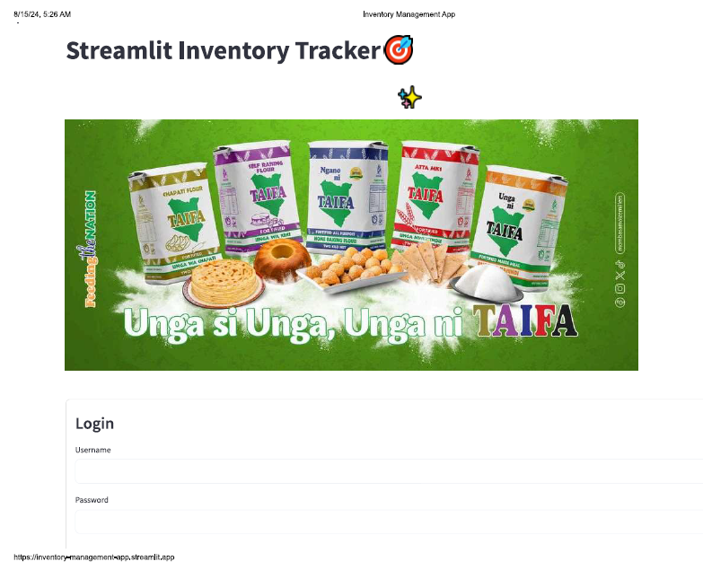

# Inventory Management Application using Streamlit

  

Welcome to my Inventory Management Application! This project showcases how to use Streamlit to create powerful data applications by embedding a Python script as the backend. The application integrates a SQLite3 database, a lightweight and serverless solution, to efficiently manage inventory computations.

## Project Overview
This project demonstrates the implementation of an Inventory Management system designed for Mombasa Maize Millers, a leading Kenyan-based grain processing manufacturer. The application provides a user-friendly interface that allows users to:
- **View Current Inventory:** Quickly access up-to-date inventory levels.
- **Add or Sell Products:** Seamlessly manage stock by adding new products or recording sales.
- **Delete a Product:** Remove obsolete or incorrect entries from the inventory.
- **Adjust Stock Balance:** Make adjustments to stock levels as needed.

## Features
- **Security:** Access to the application is secured by login credentials, ensuring that only authorized users can manage the inventory. The app also supports password changes and new user registration.
- **Versatility:** The application is accessible on both computers and mobile devices, offering flexibility for users on the go.

## Technology Stack
- **Python:** The core programming language used to build the application.
- **Streamlit:** The framework used to create the interactive web interface.
- **SQLite3:** The database used to manage inventory data without the need for a server.

## Usage

To use the Streamlit Inventory Management App, use below link:

|  Deployed App |
|------:|
| [https://inventory-management-app.streamlit.app/](/) |

The app will display the user interface, requesting login credentials.

For trial purposes, you can use the following login details:

**username:** marto

**password:** dope

## Installation

To run the Streamlit Inventory Management App locally for trial purposes, follow these steps:

1. Clone this repository: 

     ```bash
     git clone https://github.com/kaitany/Inventory-Management-App
     ```

2. Navigate to the project folder:

     ```bash
     cd Inventory-Management-App
     ```
3. Install the required dependencies:

     ```bash 
     pip install -r requirements.txt
     ```
4. Run the Streamlit app: 

    ```bash 
    streamlit run main.py
    ```


## Contributing

Contributions are welcome! If you find any issues or have suggestions, please feel free to open an issue or submit a pull request.

The application can be customized to monitor inventory for any business setup as per your preference.

## License

This project is licensed under the [<https://opensource.org/license/mit/>](LICENSE).

---

<p align="center">
  Made by Benjamin Kaitany
</p>

